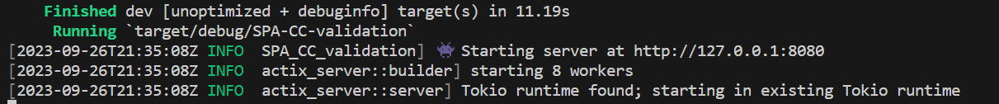
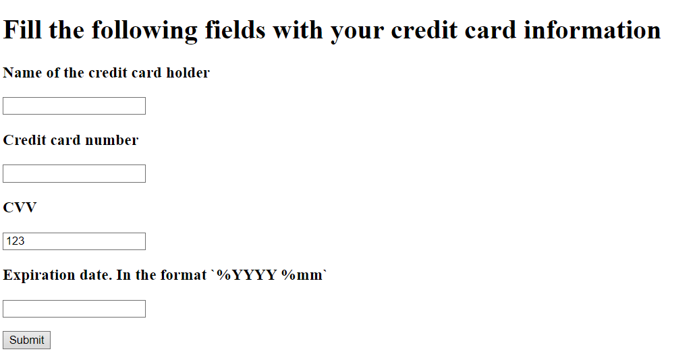

# SPA-CC-validation
  Web page with a form that performs credit card information validation. 


## Installation instructions

Follow installation instructions over [here](https://www.rust-lang.org/tools/install)

## Build and run

Once installed run

```rust
cargo build
```

Then 

```rust
cargo run
```

Output should look like this:



Go to selected endpoint and interact with form
